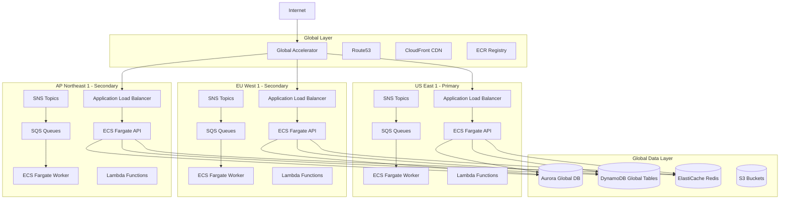
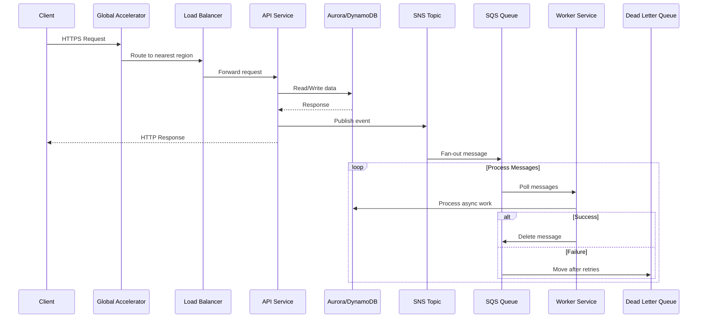

# AWS Multi-Region Stack

A production-grade, multi-region AWS infrastructure stack using Terraform, ECS Fargate, and event-driven architecture. Designed for high availability, horizontal scaling, and global distribution.

## Architecture Overview



## Event-Driven Data Flow



## Features

### Infrastructure
- **Multi-Region Deployment**: Deploy across 6+ AWS regions globally
- **Global Accelerator**: Anycast routing for optimal latency worldwide
- **ECS Fargate**: Serverless container orchestration, no EC2 management
- **Auto Scaling**: CPU, memory, and SQS queue-depth based scaling
- **Blue/Green Deployments**: Zero-downtime deployments with CodeDeploy

### Data Layer
- **Aurora Global Database**: Multi-region PostgreSQL with read replicas
- **DynamoDB Global Tables**: Multi-master NoSQL with automatic replication
- **ElastiCache Redis**: Global Datastore for caching and sessions
- **S3**: Cross-region replication for assets and backups

### Event-Driven
- **SNS Topics**: Pub/sub messaging with filter policies
- **SQS Queues**: Standard, FIFO, and Dead Letter Queues
- **Lambda Functions**: Serverless event processors
- **EventBridge**: Event routing and scheduling

### Security
- **WAF**: OWASP Top 10 protection, rate limiting, geo blocking
- **KMS**: Encryption at rest for all data stores with account-scoped policies
- **GuardDuty**: Threat detection and monitoring
- **Security Hub**: Centralized security findings
- **VPC Endpoints**: Private connectivity to AWS services
- **Secrets Manager**: Automatic credential rotation
- **IAM Least Privilege**: Scoped resource ARNs, no wildcard permissions

### Observability
- **CloudWatch**: Dashboards, alarms, and log aggregation
- **X-Ray**: Distributed tracing across services
- **OpenTelemetry**: Instrumentation and metrics collection
- **Custom Metrics**: Business KPIs like orders/min and latency p99

### Resilience
- **Circuit Breakers**: Graceful degradation on failures
- **AWS Backup**: Automated daily/weekly backups with cross-region copy
- **Fault Injection Simulator**: Chaos engineering experiments
- **Disaster Recovery Runbooks**: Documented recovery procedures

### Cost Optimization
- **Fargate Spot**: Up to 70% savings on worker services
- **AWS Budgets**: Proactive cost alerts per service
- **Cost Allocation Tags**: Detailed cost tracking
- **S3 Lifecycle Policies**: Automatic data tiering to Glacier

## Project Structure

```
aws-multiregion-stack/
├── modules/
│   ├── global/           # Global Accelerator, Route53, ECR
│   ├── region/           # VPC, ECS, ALB, SQS, SNS, Lambda, CodeDeploy
│   ├── data/             # Aurora Global, DynamoDB Global, ElastiCache
│   ├── security/         # WAF, KMS, GuardDuty, Security Hub, VPC Endpoints
│   ├── observability/    # CloudWatch Dashboards, Alarms, X-Ray
│   ├── compliance/       # CloudTrail, AWS Config, Data Retention
│   ├── resilience/       # AWS Backup, Fault Injection Simulator
│   └── finops/           # AWS Budgets, Cost Management
├── environments/
│   ├── dev/              # Development environment (single region)
│   └── prod/             # Production multi-region deployment
├── app/
│   ├── shared/           # Shared TypeScript library (@multiregion/shared)
│   │   └── src/
│   │       ├── aws/      # AWS SDK clients (DynamoDB, SQS, SNS, S3)
│   │       ├── config/   # Environment configuration with Zod validation
│   │       ├── resilience/  # Circuit breaker patterns
│   │       ├── tracing/  # OpenTelemetry setup
│   │       └── metrics/  # Custom CloudWatch metrics
│   ├── api/              # Fastify REST API service
│   │   ├── Dockerfile
│   │   └── src/
│   │       ├── routes/   # API endpoints (health, orders)
│   │       ├── services/ # Business logic
│   │       └── middleware/  # Region awareness, validation
│   ├── worker/           # SQS message processor service
│   │   ├── Dockerfile
│   │   └── src/
│   │       └── handlers/ # Message handlers (orders, notifications)
│   └── .env.example      # Required environment variables
├── localstack/
│   ├── docker-compose.yml  # Multi-region LocalStack setup (6 regions)
│   └── init-scripts/       # Per-region initialization scripts
├── scripts/
│   ├── validate-all.sh     # Validate all Terraform modules
│   ├── test-localstack.sh  # Test LocalStack infrastructure
│   └── setup-localstack.sh # LocalStack setup helper
├── tests/
│   ├── integration/      # Integration tests with LocalStack
│   ├── load/             # K6 performance tests
│   └── terraform/        # Terratest infrastructure tests
├── docs/
│   ├── adr/              # Architecture Decision Records
│   ├── runbooks/         # Operational runbooks
│   └── postman/          # API collection
├── Makefile              # Development commands (run: make help)
└── README.md
```

## Quick Start

### Prerequisites

| Tool | Version | Purpose |
|------|---------|---------|
| Terraform | >= 1.6 | Infrastructure as Code |
| Node.js | 20 | Application runtime |
| pnpm | >= 8 | Package manager |
| Docker | Latest | LocalStack and containers |
| AWS CLI | v2 | AWS interactions |

### Local Development with LocalStack

```bash
# 1. Clone and set up the project
git clone https://github.com/gufranco/aws-multiregion-stack.git
cd aws-multiregion-stack
make setup

# 2. Start LocalStack (6 AWS regions + PostgreSQL + Redis)
make localstack-up

# 3. Install and build the application
cd app
pnpm install
pnpm build

# 4. Configure environment variables
cp .env.example .env
# Edit .env with your LocalStack endpoints

# 5. Start the API
cd api
node dist/index.js
```

The API will be available at:
- **API**: http://localhost:3000
- **Health Check**: http://localhost:3000/health

### Test the API

```bash
# Health check
curl http://localhost:3000/health | jq .

# Create an order
curl -X POST http://localhost:3000/api/orders \
  -H "Content-Type: application/json" \
  -d '{
    "customerId": "550e8400-e29b-41d4-a716-446655440000",
    "items": [{
      "productId": "550e8400-e29b-41d4-a716-446655440001",
      "productName": "Test Product",
      "quantity": 2,
      "unitPrice": 29.99,
      "totalPrice": 59.98
    }],
    "shippingAddress": {
      "street": "123 Main St",
      "city": "New York",
      "state": "NY",
      "country": "US",
      "postalCode": "10001"
    }
  }' | jq .

# List orders
curl "http://localhost:3000/api/orders?customerId=550e8400-e29b-41d4-a716-446655440000" | jq .
```

### Production Deployment

```bash
# 1. Configure AWS credentials
export AWS_PROFILE=production

# 2. Initialize Terraform backend (S3 + DynamoDB for state locking)
cd environments/prod
terraform init

# 3. Review and customize variables
cp terraform.tfvars.example terraform.tfvars
# Edit terraform.tfvars with your values

# 4. Plan and apply
terraform plan -out=tfplan
terraform apply tfplan
```

## Development Commands

The Makefile provides shortcuts for common operations. Run `make help` to see all available targets.

### Infrastructure

| Command | Description |
|---------|-------------|
| `make init` | Initialize Terraform for current environment |
| `make plan` | Plan Terraform changes |
| `make apply` | Apply Terraform changes |
| `make fmt` | Format all Terraform files |
| `make fmt-check` | Check Terraform formatting |
| `make validate-modules` | Validate all Terraform modules |

### LocalStack

| Command | Description |
|---------|-------------|
| `make localstack-up` | Start multi-region LocalStack with health checks |
| `make localstack-down` | Stop all LocalStack containers |
| `make localstack-clean` | Stop LocalStack and remove volumes |
| `make localstack-status` | Show status of all regions |
| `make localstack-logs REGION=us-east-1` | Show logs for a specific region |

### Application

| Command | Description |
|---------|-------------|
| `make up` | Start everything: LocalStack + App |
| `make down` | Stop everything |
| `make app-build` | Build Docker images for API and Worker |
| `make app-test` | Run application tests |

### AWS CLI Shortcuts

These commands target LocalStack and accept `REGION=<region>`:

| Command | Description |
|---------|-------------|
| `make list-sqs` | List SQS queues |
| `make list-sns` | List SNS topics |
| `make list-dynamodb` | List DynamoDB tables |
| `make list-s3` | List S3 buckets |
| `make list-secrets` | List Secrets Manager secrets |
| `make list-all-regions` | List SQS queues across all 6 regions |

### Database

| Command | Description |
|---------|-------------|
| `make db-connect` | Connect to PostgreSQL |
| `make redis-cli` | Connect to Redis CLI |
| `make db-reset` | Drop and recreate the database |

## Region Configuration

### Supported AWS Regions

| Region | Location | Tier | LocalStack Port |
|--------|----------|------|-----------------|
| us-east-1 | N. Virginia | Primary | 4566 |
| eu-west-1 | Ireland | Secondary | 4567 |
| ap-northeast-1 | Tokyo | Secondary | 4568 |
| sa-east-1 | Sao Paulo | Tertiary | 4569 |
| me-south-1 | Bahrain | Tertiary | 4570 |
| af-south-1 | Cape Town | Tertiary | 4571 |

### Terraform Configuration

```hcl
# environments/prod/terraform.tfvars

project_name = "aws-multiregion-stack"
environment  = "prod"

regions = {
  us_east_1 = {
    enabled     = true
    aws_region  = "us-east-1"
    is_primary  = true
    tier        = "primary"
    cidr_block  = "10.0.0.0/16"
    ecs_api_min = 2
    ecs_api_max = 20
    enable_nat  = true
  }
  eu_west_1 = {
    enabled     = true
    aws_region  = "eu-west-1"
    is_primary  = false
    tier        = "secondary"
    cidr_block  = "10.1.0.0/16"
    ecs_api_min = 2
    ecs_api_max = 10
    enable_nat  = true
  }
  ap_northeast_1 = {
    enabled     = true
    aws_region  = "ap-northeast-1"
    is_primary  = false
    tier        = "secondary"
    cidr_block  = "10.2.0.0/16"
    ecs_api_min = 2
    ecs_api_max = 10
    enable_nat  = true
  }
}
```

## API Reference

### Endpoints

| Method | Endpoint | Description |
|--------|----------|-------------|
| `GET` | `/health` | Basic health check |
| `GET` | `/health/ready` | Readiness probe |
| `GET` | `/health/live` | Liveness probe |
| `GET` | `/health/detailed` | Health with dependency status |
| `POST` | `/api/orders` | Create a new order |
| `GET` | `/api/orders/:id` | Get order by ID |
| `GET` | `/api/orders` | List orders with pagination |
| `PATCH` | `/api/orders/:id/status` | Update order status |

### Query Parameters

| Endpoint | Parameter | Type | Description |
|----------|-----------|------|-------------|
| `GET /api/orders` | `customerId` | UUID | Filter by customer |
| `GET /api/orders` | `status` | string | Filter by status |
| `GET /api/orders` | `page` | number | Page number, default: 1 |
| `GET /api/orders` | `limit` | number | Items per page, default: 20, max: 100 |

### Order Status Flow

```
pending -> confirmed -> processing -> shipped -> delivered
  |            |            |
  v            v            v
cancelled  cancelled    cancelled
```

## Environment Variables

All variables are documented in `app/.env.example`. Copy it to `.env` and fill in the values.

### Application

| Variable | Description | Default |
|----------|-------------|---------|
| `NODE_ENV` | Environment: development, staging, production | `development` |
| `PORT` | API server port | `3000` |
| `PROJECT_NAME` | Project identifier used in resource names | `multiregion` |
| `CORS_ALLOWED_ORIGINS` | Comma-separated allowed origins for CORS | all origins in dev |

### AWS/Region

| Variable | Description | Default |
|----------|-------------|---------|
| `AWS_REGION` | AWS region code | `us-east-1` |
| `REGION_KEY` | Region identifier | `us_east_1` |
| `IS_PRIMARY_REGION` | Primary region flag | `true` |
| `REGION_TIER` | Region tier: primary, secondary, tertiary | `primary` |

### LocalStack

| Variable | Description | Default |
|----------|-------------|---------|
| `USE_LOCALSTACK` | Enable LocalStack mode | `false` |
| `LOCALSTACK_ENDPOINT` | LocalStack endpoint URL | `http://localhost:4566` |

### Data Stores

| Variable | Description | Default |
|----------|-------------|---------|
| `DATABASE_URL` | PostgreSQL connection string | - |
| `REDIS_URL` | Redis connection string | - |
| `DYNAMODB_ORDERS_TABLE` | DynamoDB orders table name | `multiregion-dev-orders` |

### Messaging

| Variable | Description | Default |
|----------|-------------|---------|
| `SQS_ORDER_QUEUE_URL` | Order processing queue URL | - |
| `SQS_NOTIFICATION_QUEUE_URL` | Notification queue URL | - |
| `SNS_ORDER_TOPIC_ARN` | Order events topic ARN | - |
| `SNS_NOTIFICATION_TOPIC_ARN` | Notification topic ARN | - |

## Testing

```bash
# Unit tests
make test

# Integration tests (requires LocalStack)
make localstack-up
make test-integration

# Load tests with K6
make test-load

# Terraform module validation
make validate-modules

# Terraform tests with Terratest
cd tests/terraform
go mod download
go test -v -timeout 30m
```

## Monitoring

### CloudWatch Dashboards

Each region has a dedicated dashboard displaying:
- ECS CPU and Memory utilization
- ALB request count, latency at p50, p90, and p99
- HTTP status code distribution: 2XX, 4XX, 5XX
- SQS queue depth and message age
- DLQ message count and error rate

### Alarms

| Alarm | Condition | Severity |
|-------|-----------|----------|
| API CPU High | CPU > 80% for 5 min | Warning |
| API Memory High | Memory > 80% for 5 min | Warning |
| ALB 5XX Errors | Error rate > 5% | Critical |
| P99 Latency High | Latency > 1000ms | Warning |
| DLQ Messages | Messages >= 1 | Critical |
| Queue Depth High | Messages > 1000 | Warning |

### X-Ray Tracing

Distributed tracing is enabled by default. View traces in the AWS X-Ray console to analyze request flow across services and regions.

## Security

### WAF Protection

- **AWS Managed Rules**: Core Rule Set, Known Bad Inputs, SQL Injection
- **Rate Limiting**: 2000 requests per 5 minutes per IP
- **Geo Blocking**: Configurable country restrictions
- **IP Allowlisting**: Bypass rules for trusted IPs

### Encryption

| Data | Encryption |
|------|------------|
| RDS/Aurora | KMS encryption at rest |
| DynamoDB | AWS managed encryption |
| S3 | SSE-KMS with bucket keys |
| SQS | Server-side encryption |
| ElastiCache | In-transit and at-rest encryption |
| Secrets | KMS-encrypted Secrets Manager |

### IAM Security

All IAM policies follow least-privilege principles:
- Resource ARNs scoped to specific services and prefixes
- KMS key policies use `kms:CallerAccount` conditions
- No wildcard resource permissions in production roles
- VPC flow logs scoped to specific log groups

### Compliance

- **CloudTrail**: All API calls logged with integrity validation
- **AWS Config**: Continuous compliance monitoring
- **GuardDuty**: Threat detection for accounts, workloads, and data
- **Security Hub**: Aggregated security findings

## Cost Optimization

### Strategies

- **Fargate Spot**: Workers use Spot capacity for up to 70% savings
- **Auto Scaling**: Scale down during low traffic periods
- **S3 Lifecycle**: Automatic transition to Glacier after configurable days
- **Reserved Capacity**: Commit to Aurora and ElastiCache for savings
- **Tiered Regions**: Tertiary regions run fewer tasks by default

### Budget Alerts

| Alert | Threshold |
|-------|-----------|
| Forecasted | 50%, 80% of budget |
| Actual | 100%, 120% of budget |

Alerts are sent via SNS to configured email addresses. Separate budgets track ECS and RDS spending.

## Architecture Decisions

Key architectural decisions are documented as ADRs in [docs/adr/](docs/adr/):

- [ADR-001: ECS Fargate over EC2/EKS](docs/adr/001-ecs-fargate.md)
- [ADR-002: Multi-Region Data Strategy](docs/adr/002-multi-region-data.md)
- [ADR-003: Event-Driven Architecture](docs/adr/003-event-driven-architecture.md)

## Disaster Recovery

Recovery runbooks are available in [docs/runbooks/](docs/runbooks/):

- [Disaster Recovery Procedures](docs/runbooks/disaster-recovery.md)

## License

MIT License. See [LICENSE](LICENSE) for details.
